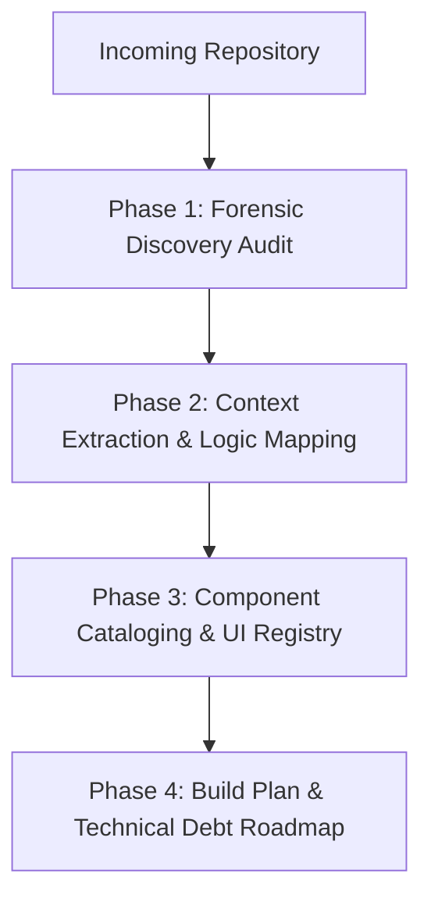

# Codebase Intake & Forensic Audit Protocol (Workflow 4A)

> **Scope:** For projects imported from other AI tools (v0, Lovable, Bolt, Replit, Cursor) or partially built codebases.
> **Objective:** Systematically audit an incoming codebase, extract locked-in context files, establish a living component registry, and build an executable roadmap without breaking existing work or guessing.

---

## Why an Intake Protocol is Mandatory

AI code generation tools (v0, Bolt, Lovable) excel at rapidly creating visual prototypes, but they share a fatal flaw: **they leave no architectural record**.
- Components sit scattered in loose directories with inline, unmapped styles.
- Mock data is tangled directly inside UI components.
- Half-finished endpoints lack validation, error handling, and ownership checks.
- If you open an IDE agent and say "finish this app", the agent will guess blindly, hallucinate duplicate components, and break existing functionality.

This protocol transforms disorganized incoming code into a disciplined, production-grade engineering repository.

---

## The 4-Step Intake Sequence

---

### Phase 1: Forensic Discovery & UX Audit

Before changing a single line of code, run a non-destructive audit:
1. **Dependency & Environment Inspection**:
   - Inspect `package.json` for pinned framework versions, UI libraries (`@radix-ui/*`, `shadcn/ui`, `lucide-react`, `tailwind`), and state libraries.
   - **Observability Audit**: Verify presence of Error Tracking (**Sentry**, **LogRocket**) and Performance APM (**Datadog**). Inspect whether Error Boundaries and PII scrubbing (`beforeSend`) exist.
   - Verify environment variables in `.env.example` (check that no production secrets are exposed in git history).
2. **Route, Page & UX Journey Inventory**:
   - Map all existing routes (e.g., `app/` or `pages/`).
   - Identify which screens are complete, which are half-built, and which are pure static stubs.
   - **User UX Research Audit**: Forensic review of existing user flows—identify cognitive friction points, excessive form steps, unhandled error states, accessibility barriers, and core Jobs-To-Be-Done (JTBD).
3. **Data & State Architecture Inspection**:
   - Identify where state lives (server state via TanStack Query, global store via Zustand, local `useState`, or hardcoded mocks).
   - Check database integrations (Prisma, Drizzle, Supabase, raw SQL) and existing schema definitions.

---

### Phase 2: Context Extraction & Logic Mapping

Reverse-engineer the project's foundational context suite from the active code:

1. **Generate `context/project-overview.md`**:
   - Document what the app currently does based on code inspection.
   - **User UX Persona & JTBD Map**: Outline primary personas, their mental models, high-friction pain points uncovered in Phase 1, and target task completion journeys.
   - Define explicit in-scope and out-of-scope boundaries for upcoming work.
2. **Generate `context/architecture.md`**:
   - Document the existing tech stack, system topology, folder structure, and database models.
   - **Observability Topology**: Document Sentry/LogRocket error capture boundaries, Datadog APM/RUM configuration, and client/server PII scrubbing filters.
   - Highlight established invariants (and note missing invariants, such as missing RLS or unauthenticated routes).
3. **Generate `context/code-standards.md`**:
   - Extract the project's existing naming conventions, styling approaches, and import aliases so future code matches existing patterns seamlessly.

---

### Phase 3: Component Cataloging & Atomic UI Registry

Tackle component sprawl, style fragmentation, and fragile UI implementations:
1. **Extract Existing Design Tokens (`context/ui-tokens.md`) & Single-Knob Cascading Audit**:
   - Inspect `globals.css` and `tailwind.config.ts`.
   - **Single-Knob CSS Variable Architecture**: Audit whether colors are declared as CSS variables in `globals.css` (e.g. `--primary: 221 83% 53%`) mapped to `hsl(var(--primary))`. Flag any hardcoded `#hex` values or unmapped Tailwind utility colors (`bg-blue-600`) for migration so altering a single CSS variable cascades globally (Figma Tokens API / webhook updater parity).
   - Document existing color tokens, typography scales, spacing units, and border radiuses.
2. **Initialize `context/ui-registry.md` with Atomic Design Classification**:
   - Walk through the existing `components/` directory and catalog every UI element into its strict atomic hierarchy:
     * **Atoms (Basic Primitives)**: Buttons, inputs, checkboxes, labels, icons, avatar chips. Must audit whether they are backed by headless **Radix UI** primitives and **shadcn/ui** patterns. Flag ad-hoc custom buttons/inputs for replacement with accessible shadcn/Radix primitives.
     * **Molecules (Compositions of Atoms)**: Search bars (`Input` + `SearchIcon` + `Button`), form fields (`Label` + `Input` + `ErrorMessage`), pagination units, user menu dropdowns.
     * **Organisms (Complex Domain Layouts)**: Product cards, data tables, navigation bars, application sidebars, modal dialog workflows.
   - **Design System Immutability Lock**: Document the atomic primitives so future sprint features strictly compose existing Atoms and Molecules rather than hallucinating new, disconnected card or button variants.
   - **Enforce the Anti-Duplication Rule**: The build agent must never create a duplicate atom, molecule, or organism when one already exists in the catalog.

---

### Phase 4: Build Plan & Technical Debt Roadmap

Translate discovered gaps into a concrete, prioritized build roadmap:

1. **Generate `context/build-plan.md`**:
   - **Phase 0: Technical Debt, Observability & Security Remediation**:
     * Fix exposed secrets and missing RLS/authorization checks.
     * Migrate unmapped inline colors to `globals.css` CSS variables for single-knob cascading.
     * Standardize legacy atoms onto accessible **shadcn/ui** and **Radix UI** primitives.
     * Wire up missing **Sentry/LogRocket** Error Boundaries and **Datadog** APM/RUM monitors with PII scrubbing.
   - **Phase 1...N: Feature Implementation**: Numbered features organized sequentially from the user flow, each with strict atomic UI composition and a 3-step verification runbook.
2. **Initialize `context/progress-tracker.md`**:
   - Populate with current completion status based on the audit.
   - Log decisions made during intake into the Decisions Log.

---

## Handover to Build Gate
Once the 4 phases are complete and approved by the developer, the repository is officially stabilized. Proceed to feature execution under the appropriate AGENTS rulebook.
