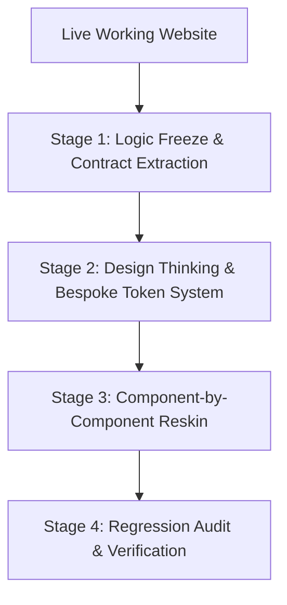

# Live Website Redesign & Reskin Protocol (Workflow 4B)

> **Scope:** For live, fully functioning websites and web applications that require a complete, high-end UI/UX overhaul to eliminate the "AI-generated" look, elevate visual polish to an elite $1,000,000 standard, and ensure responsive excellence.
> **Cardinal Invariant:** **THE LOGIC FREEZE**. Business logic, API endpoints, database queries, authentication guards, and state handlers are 100% frozen. The user experience is completely transformed, but the underlying application logic remains rock-solid with zero regressions.

---

## The Core Philosophy: Surgical Reskinning

When redesigning an existing, functioning product:
1. **Never Rebuild from Scratch**: Throwing away a working backend to "start fresh" destroys battle-tested business logic, introduces subtle bugs, and breaks database migrations.
2. **Decouple Logic from Presentation**: Separate data-fetching and state management from presentation components before touching the styling.
3. **Eradicate AI Slop**: Remove lazy card templates, rounded badge pills, generic filler copy, and timid typography. Replace them with high-contrast, editorial layout rhythms, confident negative space, and bespoke design tokens.

---

## The 4-Stage Redesign Process

---

### STAGE 1 — THE LOGIC FREEZE, UX RESEARCH & CONTRACT EXTRACTION

Before modifying any markup or CSS:
1. **Declare the Logic Freeze Boundary**:
   - Explicitly list the files containing core business logic, database queries, and API routes (e.g., `lib/db.ts`, `server/api/`, `actions/`).
   - Mark these files as **READ-ONLY**. The agent is strictly forbidden from modifying query logic, schema definitions, or endpoint responses during this workflow.
2. **Forensic User UX Research**:
   - Audit the live site for UX friction: identifying cognitive load hot spots, unnecessary form steps, poor information hierarchy, confusing empty/error states, and core Jobs-To-Be-Done (JTBD).
   - Define user mental models and target behavioral outcomes for the redesigned flows.
3. **Generate `context/architecture.md` (Frozen State & Observability Map)**:
   - Document all existing routes, server actions, and API contracts.
   - Map what data props every screen and component expects.
   - Document existing Error Tracking (**Sentry**, **LogRocket**) and Performance APM (**Datadog**) boundaries to guarantee telemetry persists through the visual overhaul.
4. **Generate `context/project-overview.md`**:
   - Document the product mission, UX research findings, persona pain points, and user journeys that must remain intact.

---

### STAGE 2 — DESIGN THINKING, SHADCN/RADIX BASE & THE $1,000,000 TOKEN SYSTEM

Apply human-centered Design Thinking to create a bespoke aesthetic that looks like an elite design agency crafted it:

1. **Tree-of-Thoughts (ToT) Layout Exploration**:
   - For every major screen, explore 2–3 divergent visual concepts:
     * How can we present this data with more elegance and lower cognitive friction?
     * Where can we replace dense, repetitive cards with asymmetrical editorial grids or progressive disclosure?
     * How can we elevate typography to carry the brand's personality?
2. **shadcn/ui + Radix UI Primitive Foundation**:
   - Initialize and configure **shadcn/ui** using headless, accessible **Radix UI** primitives. All UI interactive elements must build upon this foundation—no custom unaccessible dropdowns, dialogs, or accordions.
3. **Single-Knob Global CSS Variable Cascade (`globals.css`)**:
   - Define all color tokens as HSL or OKLCH CSS variables in `globals.css` (e.g., `--background: 0 0% 100%`, `--primary: 221 83% 53%`, `--secondary: ...`, `--destructive: ...`) mapped to `tailwind.config.ts`.
   - **Single-Knob Cascade Invariant**: Modifying a single CSS variable in `globals.css` must cascade instantaneously across every Atom, Molecule, and Organism app-wide without requiring component-level edits (enabling real-time Figma Tokens API / webhook updater parity).
4. **Generate `context/ui-tokens.md`**:
   - **Bespoke Color System**: 4–6 high-character CSS variable tokens. All text pairings must pass WCAG AA contrast (≥4.5:1).
   - **Typography System**: Pair a commanding Display font (for headlines) with a clean, functional Body font. Establish a fluid type scale across mobile (375px) and desktop.
   - **Spacing & Elevation System**: Define 8pt spacing rhythm, subtle border radiuses, and bespoke shadow treatments.
5. **Generate `context/ui-rules.md`**:
   - **THE ANTI-PILL / ANTI-BADGE LAW**: Strictly forbid rounded badge pills and icon chips above headings (e.g., `[✨ PLATFORM OVERVIEW]`). Headings must rely on pure typographic hierarchy (`h1`, `h2`, `h3`).
   - Define exact rules for form inputs, interactive tables, action buttons, and modal dialogs.

---

### STAGE 3 — ATOMIC COMPONENT-BY-COMPONENT RESKINNING

Never attempt a blanket overhaul across the entire repository in one prompt. Reskin **layer-by-layer following Atomic Design**:

1. **Phase 3A: Reskin Atoms (Primitives)**:
   - Reskin base primitives (`Button`, `Input`, `Label`, `Checkbox`, `Dialog`, `DropdownMenu`) using official **shadcn/ui** components backed by **Radix UI**.
   - Verify every atom consumes the CSS variables from `globals.css`.
2. **Phase 3B: Reskin Molecules (Combinations of Atoms)**:
   - Compose atoms into functional units: `SearchBar` (`Input` + `SearchIcon` + `Button`), `FormField` (`Label` + `Input` + `ErrorMessage`), `UserNavMenu`, pagination bars.
3. **Phase 3C: Reskin Organisms (Complex Layouts)**:
   - Assemble molecules and atoms into domain sections: `ProductCard`, `DataGrid`, `HeroSection`, `DashboardSidebar`.
   - **Design System Immutability Invariant**: Strictly assemble existing registered Atoms and Molecules. Never invent ad-hoc card variations or non-standard button styles. Future sprint features must inherit this atomic system seamlessly.
4. **Isolate Presentation from Logic**:
   - Extract raw JSX presentation into clean, reusable components that accept existing data props.
   - Ensure event handlers (`onClick`, `onSubmit`) and data hooks remain completely untouched.
5. **Imprint into `context/ui-registry.md`**:
   - As each atomic tier is redesigned, run `/imprint` to record its location, atomic tier tag (`[ATOM]`, `[MOLECULE]`, `[ORGANISM]`), and token usage.

---

### STAGE 4 — REGRESSION AUDIT & OBSERVABILITY VERIFICATION

Before shipping the redesigned interface:
1. **The Zero-Regression Verification Check**:
   - Verify every form submits successfully to the unchanged backend endpoint.
   - Verify authentication states, permissions, and role checks continue to function as before.
   - Verify all 5 screen states (loading, empty, error, default, edge cases) render properly with the new design.
2. **Observability & Error Tracking Verification**:
   - Verify that **Sentry** / **LogRocket** Error Boundaries wrap new atomic organisms and catch runtime exceptions with zero unhandled white-screens.
   - Confirm PII scrubbing (`beforeSend`) scrubs sensitive user input in forms.
   - Verify **Datadog** APM and RUM track front-end vitals (INP, LCP, CLS) with no performance degradation compared to pre-redesign baseline.
3. **The Single-Knob Cascade Verification**:
   - Modify `--primary` in `globals.css` and verify that the primary brand color flips synchronously across all buttons, active navigation states, links, and borders without breaking layout.
4. **The $1,000,000 Quality Audit**:
   - Are any generic AI badges or pill shapes present? (Must be ZERO).
   - Does copy remain authentic, human, and professional?
   - Is mobile rendering (375px) clean and free of horizontal overflow?
   - Is text contrast compliant with WCAG 2.1 AA?
5. **The Post-Reskin Testing Handoff**:
   - Immediately after each screen or organism is reskinned, present the **Testing Handoff Card** (what was changed, visual checklist, the 5 screen states, deterministic test steps).
   - Pause for the Decision Gate: *"Would you like me to test this for you right now (via browser subagent), or will you test this manually?"*

