# 🚀 Silicon Valley DevOps & Agentic Engineering Suite

> **Universal Engineering System for AI-Assisted Software Development**
> Designed for elite AI Systems Architects building production-grade software that looks like a client paid $1,000,000 for it and is engineered to withstand hostile production environments.
> Compatible across all Agentic IDEs: **Google Antigravity**, **Claude Code**, **Cursor**, **Windsurf**, and **Codex**.

---

## 1. System Overview & The Dual-Plane Architecture

This ecosystem operates on a **Dual-Plane Architecture** that bridges high-level agentic intelligence with human-readable, git-tracked project repositories:

```mermaid
graph TD
    subgraph Execution_Plane["Plane 1: The Portable Skill Plane (AI Execution Engine)"]
        K["/kickoff (4-Tier Orchestrator)"]
        IN["/intake (Tier 4 Forensic Audit)"]
        AR["/architect (Spec-First Blueprint)"]
        IM["/imprint (Atomic UI Registry Lock)"]
        RE["/review (DevOps QA Gate)"]
        RC["/recover (Circuit Breaker)"]
        RM["/remember (Cold Persistence)"]
        BC["/broadcast (Proof-of-Work Content)"]
        AU["adebayo-authority-engine"]
    end

    subgraph Project_Plane["Plane 2: The Repository Markdown Plane (Local Project Context)"]
        AG["AGENTS.md (Root Rules)"]
        CO["context/project-overview.md"]
        CA["context/architecture.md"]
        CT["context/ui-tokens.md & ui-rules.md"]
        CR["context/ui-registry.md"]
        CP["context/build-plan.md & progress-tracker.md"]
        MEM["memory.md"]
    end

    K -->|Generates & Locks| CO
    K -->|Generates & Locks| CA
    K -->|Generates & Locks| CT
    AR -->|Reads Invariants| CA
    AR -->|Checks UI Primitives| CR
    IM -->|Appends Atoms/Molecules| CR
    RE -->|Audits Code Quality| CT
    RE -->|Audits Observability| CA
    RC -->|Logs Incident RCA| CP
    RM -->|Preserves Checkpoints| MEM
```



1. **The Skill Plane (`skills/`)**: Standalone, portable `SKILL.md` workflows installed directly into your AI IDE. These drive discovery interviews, pre-feature blueprints, component cataloging, and automated QA gates.
2. **The Markdown Plane (`context/` & `AGENTS.md`)**: Human-readable, version-controlled markdown specifications stamped inside each project repository. The skills act as compilers and guardians of these files.

---

## 2. The Four Non-Negotiable Engineering Pillars

Every project built with this toolkit strictly enforces four architectural foundations:

### Pillar 1: shadcn/ui + Radix UI Foundation
* **Zero Component Guessing**: All interactive elements must build on **shadcn/ui** powered by headless, accessible `@radix-ui/*` primitives from established color variables. Hand-rolled styling from arbitrary `div`s is strictly banned.
* **Accessibility Invariant**: Every primitive must pass WCAG 2.1 AA keyboard navigation, focus rings, and ARIA contracts.

### Pillar 2: Mandatory User UX Research
* **Discovery Before Code**: Every workflow mandates structured UX Research before layouts or schemas are built.
* **Core Artifacts**: Synthesizes User Personas, Cognitive Mental Models, Jobs-To-Be-Done (JTBD), and a Task Friction Audit to eliminate dead-ends, form fatigue, and validation surprises.

### Pillar 3: Observability Baseline (Sentry, LogRocket & Datadog)
* **Error Tracking**: Catch unexpected crashes instantly using **[Sentry](https://sentry.io/)** (client/server exception capture, React Error Boundaries) and/or **[LogRocket](https://logrocket.com/)** (session reproduction).
* **Performance APM**: Full-stack applications must integrate **[Datadog](https://datadoghq.com/)** for APM, real-user monitoring (RUM), and distributed tracing.
* **Zero-PII Leakage Invariant**: Strict client & server-side scrubbing filters (`beforeSend`) prevent tokens, passwords, and user PII from being transmitted.

### Pillar 4: Atomic Design & Single-Knob Global CSS Cascading
* **Atomic Classification**: UI components are categorized strictly into:
  - **Atoms**: Indivisible primitives (`Button`, `Input`, `Label`, `Avatar`, `Badge`, `Icon`).
  - **Molecules**: Combinations of atoms (`SearchBar` = Input + SearchIcon + Button; `FormField` = Label + Input + ErrorText).
  - **Organisms**: Complex domain layouts (`ProductCard`, `DataGrid`, `Navbar`, `Sidebar`, `PricingTable`).
* **Single-Knob Global CSS Cascade**: All theme colors are declared as HSL/OKLCH CSS variables in `globals.css` mapped to `tailwind.config.ts`. Modifying a single variable in `globals.css` cascades instantaneously across every Atom, Molecule, and Organism (matching live Figma Tokens API / webhook updater parity).
* **Sprint Design System Immutability**: New or unplanned sprint additions automatically compose existing registered Atoms and Molecules from `context/ui-registry.md` without drifting or inventing ad-hoc variants.

---

## 3. The 4-Tier Workflow Calibration

Match the engineering rigor to the project's exact scope:

| Tier | Target Scope | Context Footprint | Reference Guide |
|---|---|---|---|
| **Tier 1: Mini-Website** | 2–3 page sites, portfolios, landing pages | **4 Lean Files** (`site-overview`, `design-tokens`, `page-specs`, `build-checklist`) | [`01-Mini-Website-Flow/mini-AGENTS.md`](file:///c:/Users/user/Desktop/My%20DevOp%20Tools/01-Mini-Website-Flow/mini-AGENTS.md) |
| **Tier 2: Standard Solid** | Standard full-stack CRUD apps, MVPs, dashboards | **8 Files** (`project-overview`, `architecture`, `ui-tokens`, `ui-rules`, `ui-registry`, `code-standards`, `build-plan`, `progress-tracker`) | [`02-Standard-Solid-Flow/AGENTS.md`](file:///c:/Users/user/Desktop/My%20DevOp%20Tools/02-Standard-Solid-Flow/AGENTS.md) |
| **Tier 3: Advanced SaaS** | Multi-tenant SaaS, fintech, enterprise apps with auth/billing | **11 Files** (8 Standard + `library-docs`, `user-flows`, runbooks, `.ai-memory`) | [`03-Advanced-Production-Flow/advanced-AGENTS.md`](file:///c:/Users/user/Desktop/My%20DevOp%20Tools/03-Advanced-Production-Flow/advanced-AGENTS.md) |
| **Tier 4: Intake & Redesign** | Ingesting messy AI code (v0/Bolt) or reskinning a live site | Forensic audit + Logic Freeze boundary | [`04-Redesign-and-Intake-Flow/live-website-redesign-protocol.md`](file:///c:/Users/user/Desktop/My%20DevOp%20Tools/04-Redesign-and-Intake-Flow/live-website-redesign-protocol.md) |

---

## 4. Master Toolkit Directory Structure

```text
C:\Users\user\Desktop\My DevOp Tools\
├── 01-Mini-Website-Flow/              <-- Tier 1 Prompts, 4 Lean context specs, mini-AGENTS.md
├── 02-Standard-Solid-Flow/            <-- Tier 2 Prompts, 8 context file generation framework, AGENTS.md
├── 03-Advanced-Production-Flow/        <-- Tier 3 Prompts, 11 production context specs, advanced-AGENTS.md
├── 04-Redesign-and-Intake-Flow/        <-- Tier 4 Intake audit protocol & live website redesign protocol
├── 05-Global-IDE-Master-Rule/          <-- Master IDE rule file (GLOBAL_IDE_MASTER_RULE.md)
├── Full Build Approach/               <-- Universal skill specifications & standard AGENTS.md
├── skills/                            <-- 9 Master Portable Agent Skills
│   ├── kickoff/                       <-- /kickoff (4-tier orchestrator with full references)
│   ├── intake/                        <-- /intake (Tier 4 forensic audit & live redesign)
│   ├── architect/                     <-- /architect (Spec-first blueprint engine)
│   ├── imprint/                       <-- /imprint (Atomic UI registry compiler)
│   ├── review/                        <-- /review (DevOps QA & observability gate)
│   ├── recover/                       <-- /recover (Circuit breaker on 1st bug failure)
│   ├── remember/                      <-- /remember (Multi-session persistence)
│   ├── broadcast/                     <-- /broadcast (4 daily proof-of-work posts)
│   └── adebayo-authority-engine/      <-- Commercial positioning, offers & human voice
├── business strategy/                 <-- Client acquisition & deployment playbooks
├── AGENTS.md                          <-- Root governing agent standard
├── GLOBAL_AGENTS_STANDARD.md          <-- Universal anti-slop directive & core engineering invariants
├── sync-skills.ps1                    <-- One-click cross-IDE distribution script
└── README.md                          <-- This master documentation file
```

---

## 5. End-to-End Operating Playbooks

### Playbook A: Starting a New Project from Scratch
1. Open your AI IDE (Antigravity, Cursor, Claude Code) in an empty project directory.
2. In the chat, type:
   ```text
   /kickoff "I am building a [brief description of product]"
   ```
3. The skill interviews you on scope, target audience, and calibrates Tier 1, 2, or 3.
4. The skill executes the **UX Research** interview, stack selection, and visual design rules.
5. The skill generates your project's `AGENTS.md` and compiles the `context/*.md` suite.
6. Review and confirm the generated context files before building.

---

### Playbook B: Building a Feature During Sprints
1. Before writing code for any complex or non-trivial feature, type:
   ```text
   /architect "Build the [feature name]"
   ```
2. The agent reads `context/architecture.md` and `context/ui-tokens.md`, decomposes the UI into Atoms, Molecules, and Organisms, verifies Sentry Error Boundaries, and presents a 2-minute blueprint.
3. Once approved, the agent implements the feature using **shadcn/ui** and **Radix UI** primitives bound to CSS variables.
4. Immediately upon completing the UI, the agent runs:
   ```text
   /imprint
   ```
   This verifies single-knob CSS variables and registers the component in `context/ui-registry.md`.

---

### Playbook C: When an Error or Test Fails
* **The Circuit Breaker Rule**: Never allow an agent to make multiple blind patch attempts.
* If a fix fails on the first attempt, run:
  ```text
  /recover
  ```
* The skill freezes code modifications, inspects `git diff`, classifies the failure (Tier 1 Local, Tier 2 Contract Collision, Tier 3 Context Collapse), and executes a verified surgical fix with regression testing.

---

### Playbook D: Release, QA & Demo Gate
Before deploying to production or demonstrating to a client, type:
```text
/review
```
The agent executes terminal commands (`tsc --noEmit`, `npm run build`, automated secret scan), audits zero-trust BOLA/IDOR authorization, verifies Sentry PII scrubbing, tests the single-knob CSS cascade, and delivers a prioritized **P0 (Blocker) / P1 (Critical) / P2 (Polish)** defect report.

---

### Playbook E: Session Pausing & Cold Resumption
* **To end a session**:
  ```text
  /remember save
  ```
  Appends a structured checkpoint to `memory.md` with zero secret leakage.
* **To resume work in a fresh chat**:
  ```text
  /remember restore
  ```
  Reconciles git reality, reads context in protocol order, and identifies the exact next code edit.

---

### Playbook F: Daily Proof-of-Work Marketing
At the end of your build day, run:
```text
/broadcast
```
The skill reads your completed features and architectural lessons from `progress-tracker.md`, generates **4 daily LinkedIn/X posts** following your human-voice positioning rules, and saves them directly to `C:\Users\user\Desktop\Lifestream\content\queue\` for your Telegram publisher bot.

---

## 6. Synchronizing Skills Across All Your IDEs

Whenever you modify any skill in `skills/`, distribute it across all your agentic IDEs by running the PowerShell sync script:

```powershell
powershell -ExecutionPolicy Bypass -File "c:\Users\user\Desktop\My DevOp Tools\sync-skills.ps1"
```

This automatically synchronizes the entire suite to:
* **Google Antigravity**: `C:\Users\user\.gemini\config\skills`
* **Claude Code CLI**: `~/.claude\skills`
* **Cursor**: `~/.cursor\rules`
* **Windsurf**: `~/.codeium\windsurf\skills`

---

## 7. Distributing to Other Builders & Automated Sync (Strategy 1)

### For Other Builders (1-Line Remote Install)

Other engineers on your team or in your community can install the entire suite into their AI IDEs with a single terminal command:

#### Windows (PowerShell):
```powershell
irm https://raw.githubusercontent.com/adebayokareem/my-devop-tools/main/install.ps1 | iex
```

#### macOS / Linux (Terminal):
```bash
curl -fsSL https://raw.githubusercontent.com/adebayokareem/my-devop-tools/main/install.sh | bash
```

### How Updates Flow to Other Builders
1. **You push improvements**: Whenever you refine a skill or prompt in `My DevOp Tools`:
   ```bash
   git add .
   git commit -m "feat: upgrade kickoff framework"
   git push origin main
   ```
2. **Builders receive updates**:
   - Running the 1-liner installer again will pull changes and re-sync.
   - Alternatively, builders can run their local sync script:
     ```powershell
     powershell -ExecutionPolicy Bypass -File "$HOME\My-DevOp-Tools\sync-skills.ps1"
     ```
   - Because `sync-skills.ps1` runs `git pull --ff-only` on execution, it checks GitHub for new changes and copies them into Antigravity, Claude Code, Cursor, and Windsurf in under 2 seconds.

